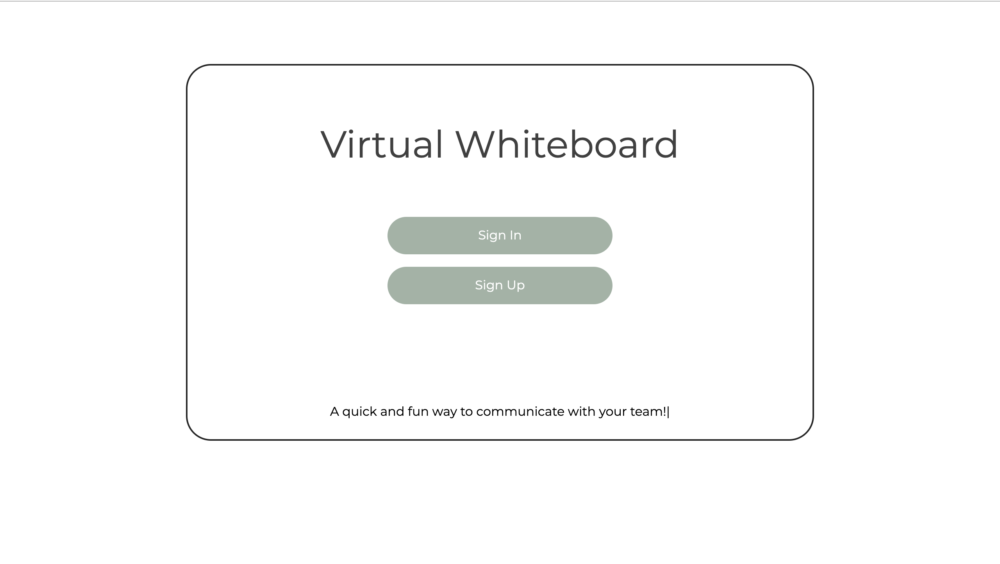
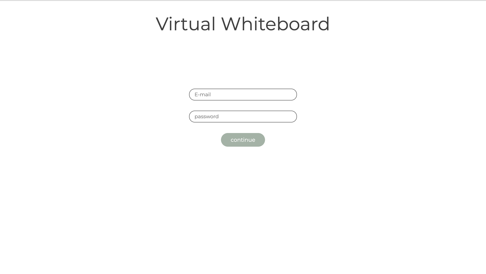
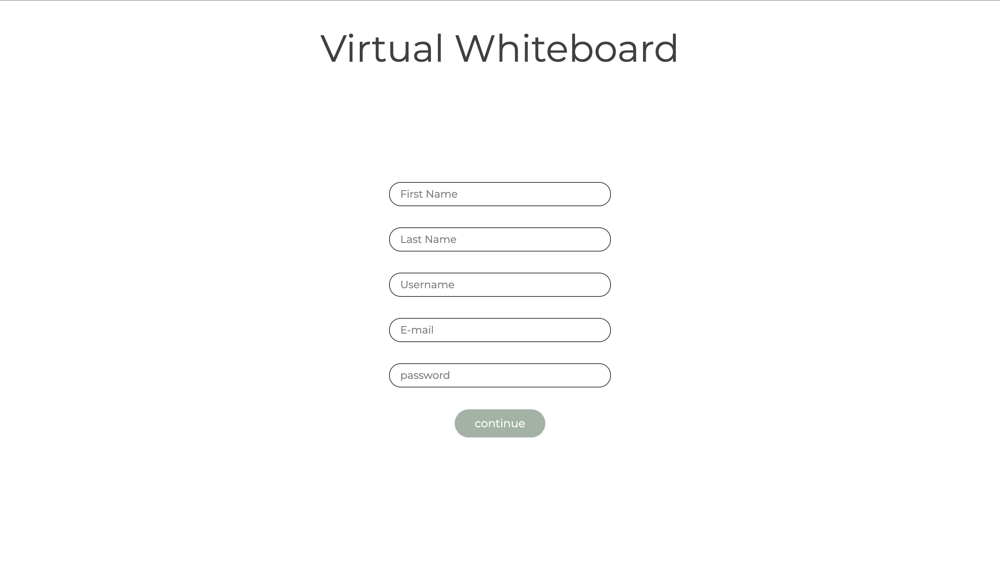
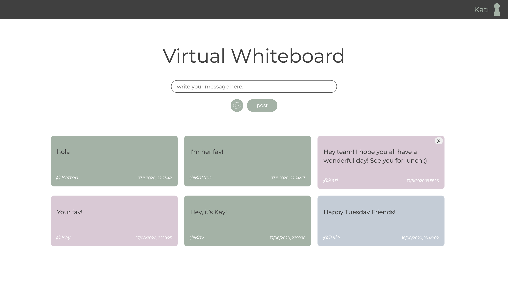

Virtual White Board by Katrine Iversen

### `instructions`

- Clone repository 
- "npm install"
- "npm install --save firebase"
- "npm start"
- Create account and use the application

### User Interface

### Link

https://kapathy.github.io/virtual-white-board/
